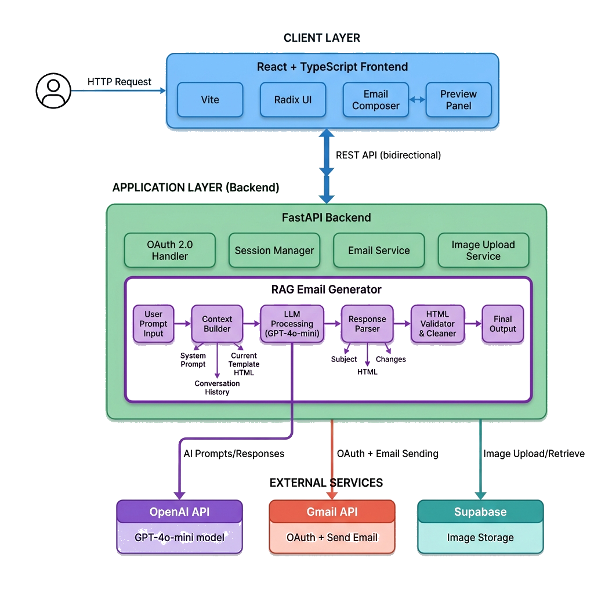

# Embedded Email Template & Gmail Integration

This project is a modern Email Studio that allows you to create, edit, and send HTML emails using your own Gmail account via secure OAuth 2.0 integration.

## 🚀 Project Structure

- **frontend/** (Root): React + TypeScript application for the UI.
- **backend/**: FastAPI (Python) server handling OAuth and Email Sending.

### 📂 Directory & File Structure

This is where your files should be:

```text
Embedded Email Template/
├── .gitignore
├── package.json
├── src/               <-- Frontend Code
├── backend/           <-- Backend Code
│   ├── app.py
│   ├── requirements.txt
│   ├── .env           <-- CREATE THIS FILE HERE!
│   └── venv/          <-- Created by you
```

---

## 🏛️ System Architecture



The MailCraft AI system follows a modern, decoupled full-stack architecture:

1. **Frontend (React + TypeScript):** A responsive, single-page application that provides a rich user interface for the Email Studio. It allows users to design, edit, and preview email templates, as well as manage their Google authentication state.
2. **Backend (FastAPI - Python):** The core server that acts as a secure bridge between the frontend, Google APIs, and AI services. It handles:
   - **Google OAuth 2.0:** Manages secure authentication and session persistence for connecting users' Gmail accounts.
   - **Gmail API Integration:** Securely dispatches emails directly through the authenticated user's Gmail account.
   - **AI Email Generation:** Integrates with OpenAI models to dynamically generate professional HTML email templates based on user prompts.
   - **RAG & Data Storage:** Utilizes Supabase (PostgreSQL with pgvector) and OpenAI embeddings for Retrieval-Augmented Generation, allowing semantic search of saved templates and storing user-uploaded assets.

---

## 🛠️ Setup Instructions

### 1️⃣ Backend Setup (Python)

The backend handles the secure connection with Google.

1.  **Navigate to the backend folder:**
    ```bash
    cd backend
    ```

2.  **Create a Virtual Environment (venv):**
    *   **Windows:**
        ```powershell
        python -m venv venv
        .\venv\Scripts\activate
        ```
    *   **Mac/Linux:**
        ```bash
        python3 -m venv venv
        source venv/bin/activate
        ```

3.  **Install Dependencies:**
    ```bash
    pip install -r requirements.txt
    ```

4.  **Configure Environment Variables:**
    *   Create a `.env` file in the `backend` folder.
    *   Add your Google OAuth credentials (see `backend/.env.example` if available, or ask the developer):
        ```env
        GOOGLE_CLIENT_ID=your_client_id_here
        GOOGLE_CLIENT_SECRET=your_client_secret_here
        BASE_URL=http://localhost:8000
        FERNET_KEY=your_generated_fernet_key
        SESSION_SECRET=your_random_secret
        ```

5.  **Run the Server:**
    ```bash
    uvicorn app:app --reload
    ```
    *   The server will start at `http://127.0.0.1:8000`.

---

### 2️⃣ Frontend Setup (React)

The frontend is the user interface where you compose and send emails.

1.  **Open a new terminal** (keep the backend running).

2.  **Navigate to the project root:**
    ```bash
    cd "d:/Coding Area/Embedded Email Template"
    ```

3.  **Install Node Modules:**
    ```bash
    npm install
    ```

4.  **Run the Development Server:**
    ```bash
    npm run dev
    ```
    *   The app will open at `http://localhost:3000`.

---

## 📧 How to Use

1.  **Connect Gmail:**
    *   Go to **Gmail Settings** in the left sidebar.
    *   Click **Connect Gmail Account**.
    *   Authorize the app with your Google credentials.
    *   You should see "Gmail Connected" status.

2.  **Compose & Send:**
    *   Go to **Compose Email** or select a template.
    *   Fill in "To", "Subject", and content.
    *   Click **Send Email**.
    *   Wait for the success message!

## ⚠️ Troubleshooting

*   **"Not Connected" Error:** Try refreshing the page and reconnecting. Ensure backend is running.
*   **OAuth Error:** Ensure your `GOOGLE_CLIENT_ID` in `.env` matches your Google Cloud Console settings and "http://localhost:8000/auth/google/callback" is added as a Redirect URI.